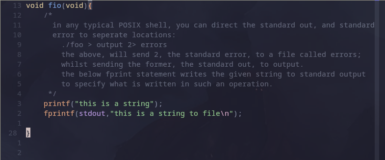
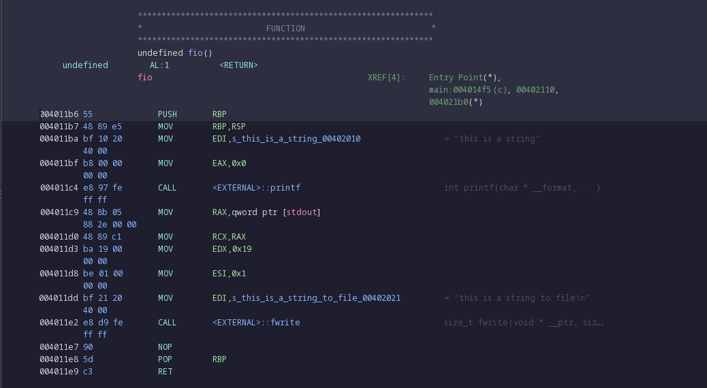
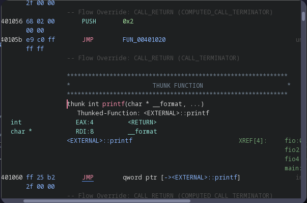

# Ghidra  
  
 
 ## <u>practicing recognising standard code blocks in assembly.</u>
 
 ### <u>Using C practice as examples</u>
 ### *Chapt. 9*
 this covers chapter 9 from Beej's guide to C.  
 I wrote this so each function can be ran with a terminal input, providing a value to a switch statement.  

### fio()(*File I/O*)
- very simple function, first prints a string using *printf()*, then writes to **STDOUT** using *fprintf()*.  
	
- The assembly representation provided by ghidra is as follows:
 
 
 - the first block up until the first *MOV* function, are related to the definition of the function, it's entry point, and it's return type.
 - the next, moves the previous top of the [*stack*](glossary.md#stack) to RBP; which is a call preserved register. it does this to save the current [*frame pointer*](glossary.md#frame-pointer) so it can be returned to later.
 
 - The next line, moves the string "this is a string" into EDI, the E refers to a data register, and is used for I/O access. the DI is for "destination index" referring to the destination of the MOV command; STDOUT in this case.
 - immediately after this line, a character is moved into the accumulator register. This register serves a similar purpose to the data register. The character passed, is \0; this is a special character that denotes the end of a string.
 - CALL looks up an external function, in this case *printf*:
 
 This shows the [THUNK function](glossary.md#thunk-function), this is a placeholder for code loaded at runtime, this instance takes the input, and *JMP*s to the actual location of printf in the external call, where the actual logic to print is handled. 
 
 
 - RAX is a "long" size register, sized at 64 bits. *qword ptr* denotes a pointer to a string's address in memory. In this case, the pointer is to stdout. Due to the change from 32-bit to 64-bit, rax is actually an extension of eax, which is an extension of ax- it's 16-bit predecessor. They are all the same register, so this is the same as writing to EAX.
 - This above line, and the MOV function below it, denote the start of the next function, fwrite.  
 
 -the value '0x19' corresponds to the length of the string used in fwrite. the pointer previously mentioned, is from the function itself, as it writes to stdout. The values used in the logic for fwrite are moved into the needed registries, then an external call to fwrite is made, calling to it's thunk function to be executed. 
 
 
 
### fio1()

- 